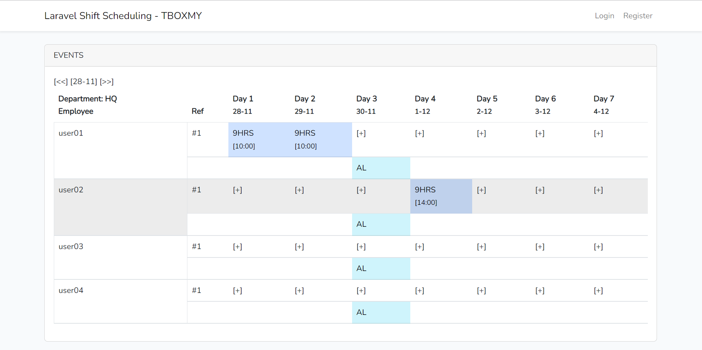

<p align="center"><a href="https://tboxmy.blogspot.com" target="_blank">Blogspot</a></p>

## About

Corona Shift project provides a design framework to manage shift scheduling that leverage on Laravel programming environment.



## What

This project provide the base components to handle planning of employee shift schedule. The framework is best described by the database structure, while the application demonstrates how the database is used. This includes;

-   Manage shift schedules manually
-   Manage employee assignment to shifts base on department
-   Manage special occassions, such as holidays and special event days
-   Manage shift rules
-   Manage employee constraints for shift assignment. This include user time off, selecting employee based on skills they are good at, local regulation on number of working hours.

Flexibility of this framework allows scheduling for different organisation needs. Such as rotating shifts, DuPont shifts, Pitman (2-3-2) schedule, 4on-4off schedule, graveyard shifts and events based shift.

Anyone who can relate to the database, will be able to reproduce this framework in any programming language.

## Why

As more organisations get involved in managing employee schedules, a standard method to establish employee duty hours that is flexible will provide quicker updates to those invloved.

Having a established a shift schedule approach will benefit any organisation. It is an important step that dictates much of the people management and resource planning process.

Why Laravel? It my personal choice at this moment. This will allow the application to be quickly deployed as a web application, or backend API, or single page application (SPA), or component for Laravel projects.

Through this framework, it can be easily extended to automated shift scheduling systems.

## Project setup

| Component       | notes  |
| --------------- | ------ |
| PHP             | 7.4    |
| Nodejs          | 12.22  |
| Laravel         | 9      |
| Bootstrap (npm) | 5      |
| Popper (npm)    | 2.11.6 |
| dateFns         | 2.29.3 |

Notes:

-   JQuery is setup, however I have decided to continue without it at this stage as JavaScript is able to provide the required functions.
-   Moment is setup, however dateFns is now implemented where possible to leverage at lighter code.

## Installing this project

```
git clone <SSH><USER><URL>
php artisan migrate
php artisan db:seed --class=DefaultUserSeeder
php artisan db:seed --class=DefaultTypesSeeder
OR
php artisan migrate:fresh --seed --seeder=DefaultTypesSeeder

php artisan db:seed --class=DefaultDepartmentUserSeeder
```

-   Configure database settings in the file .env

## How this project was setup

```
composer create-project --prefer-dist laravel/laravel shift-scheduling
composer require laravel/ui
php artisan ui bootstrap --auth
npm install bootstrap@latest @popperjs/core --save-dev
npm install jquery jquery-ui --save-dev
npm install dateFns
npm install && npm run dev
php artisan storage:link
```

Note: post install message
C:\Users\tboxmy\AppData\Roaming\npm-cache_logs\2022-11-26T02_23_56_425Z-debug.log

Folder storage should be allowed to write. Where higher folder security is applied such as SELINUX, then this needs to be allowed.

Example of php artisan used;

```
php artisan make:model ShiftUser -mcr
php artisan make:model DepartmentUsers -mcr
php artisan make:seeder DefaultUsersSeeder
php artisan make:seeder DefaultTypesSeeder
```

# Update .env with database details

DB Configuration with Postgresql

```
DB_CONNECTION=pgsql
DB_HOST=127.0.0.1
DB_PORT=5432
DB_DATABASE=scheduling
DB_USERNAME=postgres
DB_PASSWORD=postgres
```

## Bootstrap

Installed using Laravel mix

```
npm install bootstrap
npm install sass && npm install sass-loader
npm run dev
```
